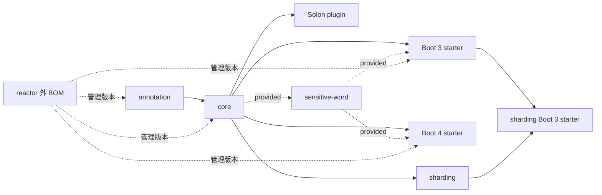

# 构建、测试与发布

本文记录 2026-08-02 当前工作树可由 POM、资源和仓库内工作流静态确认的流程。命令分为“推荐命令”和“本轮/此前已运行”；未实际执行的命令不表示已经通过。模块职责见 [MODULES.md](MODULES.md)，测试现状见 [TESTING.md](TESTING.md)，版本边界见 [COMPATIBILITY.md](COMPATIBILITY.md)。

## Maven 项目结构

根 `com.mongoplus:mongo-plus:2.2.0` 是 `packaging=pom` 的父/聚合 POM。根 reactor 有 8 个 JAR 模块：

| 模块 | Java target | 直接项目内依赖 | 测试跳过属性 |
|---|---:|---|---|
| `mongo-plus-annotation` | 8 | — | — |
| `mongo-plus-core` | 8 | annotation | — |
| `mongo-plus-boot-starter` | 8 | core；sensitive-word `provided` | `maven.test.skip=true` |
| `mongo-plus-boot4-starter` | 17 | core；sensitive-word `provided` | `maven.test.skip=true` |
| `mongo-plus-solon-plugin` | 8 | core | — |
| `mongo-plus-sharding` | 8 | core | `maven.test.skip=true` |
| `mongo-plus-sharding-boot-starter` | 8 | Boot 3 starter、sharding | `maven.test.skip=true` |
| `mongo-plus-sensitive-word` | 8 | core `provided` | `maven.test.skip=true` |

`mongo-plus-bom:2.2.0` 是独立 `packaging=pom`，没有 parent，未列入根 `<modules>`。它管理上述 8 个公开构件；根 POM 又在 dependencyManagement 中导入该 BOM。



箭头指向下游依赖者；图只展示项目内最小关系。Boot 4 当前没有 sharding starter。

## Java、Maven 与插件要求

### 静态声明

- 根及除 Boot 4 外的模块声明 `maven.compiler.source/target=8`；Boot 4 模块声明 17。没有使用 `<release>`。
- Boot 3.4.2 应用侧至少需要 Java 17；模块 target=8 不能把 Boot 3 运行下限降到 8。Boot 4 模块 target=17。Solon/core 的 JDK 8 实际运行尚未验证。
- 仓库没有 Maven Wrapper、`.mvn/maven.config`、`.mvn/jvm.config`、Enforcer、toolchains、显式 compiler/surefire/failsafe 版本，也没有声明最低 Maven 版本。
- 因此 `mvn` 使用调用环境安装的 Maven和其默认/超级 POM 插件版本；发布前应记录 `mvn -version`，不能由仓库静态推断最低 Maven。

### 当前开发环境（本轮已运行）

- `mvn -version`：Maven 3.9.2，Maven 运行时 JDK 17.0.16。
- 独立 `java -version`：JDK 21.0.11。它与 Maven 使用的 JDK 不同，构建判断应以 `mvn -version` 为准。
- `codegraph status`：603 files、10,908 nodes、22,786 edges，索引为 up to date。
- `where java`：依次命中 Oracle javapath、Java 8 javapath、`D:\Java\jdk-17\bin\java.exe`；shell 实际首项为 Java 21，而 Maven 报告其运行时来自 `D:\Java\jdk-17`，说明 Maven 启动环境/JAVA_HOME 与 shell 首个 `java` 不同。
- `where mvn`：`D:\apache-maven-3.9.2\bin\mvn` 与 `mvn.cmd`。
- `mvn help:active-profiles`：首次因沙箱禁止写 `D:\repository\...\resolver-status.properties` 失败；获准写本地 Maven 仓库后成功。当前 settings 还提供一个外部 `release` profile；各项目自身及继承自根的 `release` 也处于活动状态。
- `mvn validate`：成功；Maven 报告 9 个 reactor project（根 parent/aggregator + 8 个 JAR 模块）全部 `SUCCESS`。这只验证模型和 validate 阶段，不是 compile/test/package/install/deploy 证据。

编译 target、Maven 运行 JDK、框架运行下限和当前 shell 默认 JDK 是四个不同概念。

## 常用构建命令

以下均为仓库结构支持的推荐命令；除“已运行状态”明确列出的命令外，本轮未执行。

| 目的 | 命令 | 边界 |
|---|---|---|
| reactor validate | `mvn validate` | 8 个 reactor 模块；不含 BOM |
| reactor compile | `mvn -DskipTests compile` | 编译，不验证行为 |
| reactor test | `mvn test` | 当前 reactor 无可执行测试；部分模块强制 skip |
| reactor package | `mvn package` | `release` profile 默认激活，可能执行 sources/javadoc 配置 |
| reactor install | `mvn install` | 安装 2.2.0 到本地仓库，不是发布 |
| 跳过测试 package | `mvn -DskipTests package` | 编译测试源码但跳过执行的通常语义；模块 `maven.test.skip=true` 更强 |
| 完全跳过测试编译/执行 | `mvn -Dmaven.test.skip=true package` | 不提供测试证据 |
| 单模块及上游 | `mvn -pl mongo-plus-core -am test` | 将 artifact/module 路径替换为目标模块 |
| BOM 独立验证 | `mvn -f mongo-plus-bom/pom.xml verify` | BOM 不可由根 `-pl` 选择 |
| BOM 独立安装 | `mvn -f mongo-plus-bom/pom.xml install` | 根 POM 导入 2.2.0 BOM 时，干净本地仓库可能先需要它 |
| 独立测试工程 | `mvn -f mongo-plus-test/pom.xml -Dmaven.test.skip=false test` | 该目录未跟踪且不在 reactor；需要可解析的 2.2.0 构件 |

### 单模块与干净本地仓库

- 从根目录使用 `-pl <module> -am`，让 Maven 同时构建 reactor 内上游。例如 sharding starter 应使用 `mvn -pl mongo-plus-sharding-boot-starter -am test`，其上游包括 annotation、core、Boot 3 starter 和 sharding。
- `mvn -f <module>/pom.xml ...` 不会自动构建 reactor 兄弟；若本地仓库没有同版本 parent/BOM/上游构件，可能解析失败。
- 当前根 POM导入 reactor 外的 `mongo-plus-bom:2.2.0`。从干净本地仓库验证时，应先独立 install BOM，再从根构建 reactor；若模块单独执行，还需先 install 根 parent 和所需上游。
- `mongo-plus-test/` 既不是根 module，也不是正式发布构件。它的现存报告不能扩张为 reactor CI 保障。
- Boot 4 的任何 compile/test/package 命令都需要 Maven 运行于 JDK 17+。

## 测试现状

当前 8 个 reactor 模块中，仅 `mongo-plus-core/src/test` 存在且为空；其余模块没有 `src/test`。根与 reactor POM 未声明 JUnit/TestNG，未配置专用 surefire/failsafe 或集成测试 profile，也未发现 Testcontainers。

未跟踪、reactor 外的 `mongo-plus-test` 当前有四个 JUnit 4 测试源：`BuildConditionRegexTest`、`BuildConditionNotTest`、`MongoPlusTransactionalManagerTest` 和 `CollectionLogiceInterceptorIgnoreUpdateTest`，并存在本机测试输出。它们的目录状态可变化，不能当成仓库发布门禁。事务与 IgnoreLogic 测试使用代理对象；真实 MongoDB、Boot/Solon context 和分片仍没有 reactor 内自动化保障。

### 已有、推荐、缺失与本轮状态

- 已有：reactor 内没有可执行测试；reactor 外未跟踪工程有两个条件构建测试。
- 推荐：把纯 BSON/转换回归放入 core；容器接线放入对应 starter/plugin；MongoDB 语义使用真实 replica set/sharded 环境。
- 缺失：CRUD、mapping、两类 interceptor、三套容器、事务、多数据源、分片、发布 smoke test。
- 本轮：运行了版本/路径/索引检查、`help:active-profiles` 和全 reactor `validate`；没有执行 compile/test/package/install/deploy。
- 此前文档记录：`mvn -pl mongo-plus-core -am -DskipTests compile` 在 Maven 3.9.2/JDK 17.0.16 成功；两个 starter 的定向 dependency tree 成功。它们不是本轮结果，也不是行为/兼容性证明。Driver dependency tree 此前未成功，原因未在当前知识库中固定。

## 最小验证矩阵

| 修改类型 | 推荐最小命令 | JDK | MongoDB/容器补充 |
|---|---|---:|---|
| core 纯 Java | `mvn -pl mongo-plus-core -am test` | 当前 target 8；至少用声明矩阵 JDK | BSON 纯逻辑不需要；CRUD/Driver 需要真实 MongoDB |
| Boot 3 | `mvn -pl mongo-plus-boot-starter -am test` | 17+ | 独立 Boot 3 context、Mapper CRUD、事务 |
| Boot 4 | `mvn -pl mongo-plus-boot4-starter -am test` | 17+ | 独立 Boot 4 context，不能复用 Boot 3 结果 |
| Solon | `mvn -pl mongo-plus-solon-plugin -am test` | 声明 target 8；运行下限待验证 | Solon context、Mapper/注解绑定 |
| annotation | `mvn -pl mongo-plus-annotation -am test` | target 8 | 消费注解时还要构建 core 和三套集成 |
| sensitive-word | `mvn -pl mongo-plus-sensitive-word -am test` | target 8 | 当前模块 skip；需显式建立测试并做映射组合 |
| sharding | `mvn -pl mongo-plus-sharding-boot-starter -am test` | Boot 3 应用 17+ | 至少两数据源、事务、并发路由 |
| BOM/POM | `mvn validate`；`mvn -f mongo-plus-bom/pom.xml verify` | Boot 4 检查需 17+ | dependency tree、干净本地仓库、版本一致性 |
| 文档 only | 链接检查、`git diff --check` | 无 | 不声称 Maven 已验证 |

表中 `test` 是目标命令，不承诺测试已存在；模块带 `maven.test.skip=true` 时必须先建立测试并覆盖/移除该属性，才有测试证据。

## Dependency Management 与 BOM

- 根 dependencyManagement 导入 MongoDB Driver BOM 5.4.0 和 `mongo-plus-bom:2.2.0`，并管理 Boot 3、Solon、AspectJ、Spring TX、日志、Bouncy Castle 等版本。
- 独立 BOM 没有 parent；自己的 `${mongoplus.version}=2.2.0` 管理全部 8 个公开模块。
- Boot 3/Core 等多数项目内依赖不写版本，由根导入的 BOM 管理；Boot 4 对 core/sensitive-word 显式写 `${mongoplus.version}`，并显式覆盖 Boot 4、Spring TX、AspectJ 版本。
- 用户导入 BOM 的语义是 dependencyManagement 版本对齐，不会像 parent 一样继承 build/profile/plugin/properties，也不会自动引入依赖。

示例（坐标由当前 BOM 支持）：

```xml
<dependencyManagement>
  <dependencies>
    <dependency>
      <groupId>com.mongoplus</groupId>
      <artifactId>mongo-plus-bom</artifactId>
      <version>2.2.0</version>
      <type>pom</type>
      <scope>import</scope>
    </dependency>
  </dependencies>
</dependencyManagement>
```

新增公开模块时至少同步：根 modules（若应进 reactor）、依赖方向、独立 BOM、消费它的 starter、版本升级清单、[MODULES.md](MODULES.md) 和 [COMPATIBILITY.md](COMPATIBILITY.md)。遗漏 BOM 会让用户无法统一管理新构件版本。

## 版本升级流程

当前 POM 不使用 revision/changelist、flatten-maven-plugin、versions-maven-plugin 或 CI-friendly versions。不要把相应命令写成本项目既有标准。

最小人工清单：

1. 更新根 `<version>` 和 `<mongoplus.version>`。
2. 更新 8 个子模块的 parent version；检查 Boot 4 显式 `${mongoplus.version}` 依赖。
3. 更新独立 BOM 自身 `<version>` 与 `<mongoplus.version>`。
4. 检查根导入的 BOM version、BOM 管理的 8 个 artifact 和所有 starter 依赖。
5. 检查 README/用户文档示例、Maven Central 坐标、changelog/release notes。
6. 独立验证 BOM，再从干净本地仓库验证 reactor 和各集成。

## 发布配置

### 当前 POM 静态确认

- 根、8 个 reactor 模块和独立 BOM 都定义 `release` profile，且 `activeByDefault=true`。
- `activeByDefault` 只表示在其所在 POM 没有另一个显式激活 profile 时默认激活，不是不可关闭的永久契约；显式激活同一 POM 的其他 profile 会抑制该默认激活。当前 POM 没有其他 profile，但本机 settings 另有同名外部 `release`，本轮 `help:active-profiles` 显示两类 profile 同时活动。
- profile 配置 `org.sonatype.central:central-publishing-maven-plugin:0.6.0`，`publishingServerId=central`。
- `maven-release-plugin:2.5.3` 配置 `autoVersionSubmodules=true`、`releaseProfiles=release`、`goals=deploy`。
- `maven-source-plugin:2.2.1` 附加 sources；JAR 模块的 javadoc 插件 3.6.3 配置 jar execution，根/BOM 只声明插件。
- `maven-gpg-plugin:1.5` 整段被注释，当前有效模型没有签名 execution。
- profile 的 `distributionManagement` 使用 server id `release`，指向旧 `s01.oss.sonatype.org` snapshot/staging URL；Central publishing 插件使用的 server id 则是 `central`。
- 未发现 nexus-staging、显式 maven-deploy-plugin 或其他 signing profile。
- 未配置 Central 插件的 `autoPublish`、`waitUntil`，也未配置 `deployAtEnd`；仅凭 POM 不推断这些参数的插件默认值。

这些配置同时出现 Central Portal 扩展与 OSSRH distributionManagement。标准 deploy 仓库查找使用 `distributionManagement` 的 `release`；Central 扩展自己的凭据查找使用 `publishingServerId=central`，并在本轮 Maven 模型加载时安装 Central Publishing features。一次实际 `mvn deploy` 是否同时触发/拦截哪条上传路径、是否需要签名或平台端手工 publish，仍须用隔离凭据和平台状态验证；配置存在不等于 deploy 可成功。

### 敏感信息边界

只可记录 server id `central`、`release` 以及工作流 secret/环境变量名称。当前仓库没有 CI 工作流，也没有可安全确认的 secret 名；不得读取或输出 settings.xml 中的实际凭据。

## CI 与发布自动化

当前仓库不存在 `.github/`、`.gitee/`、GitLab CI、Jenkinsfile 或 Azure Pipelines 文件。因此无法确认 build job、Java matrix、Maven cache、tag/branch trigger、release creation、CI secrets 或自动 Maven Central 发布。当前证据只支持“仓库内没有 CI 定义”，不能推断外部平台没有独立流水线，也不能断言发布只能人工完成。

## 发布顺序

根 reactor 可按依赖拓扑一次进入 9 个 project 的构建/deploy 生命周期：根 parent/aggregator、annotation → core → sensitive-word/Boot 3/Solon/sharding → sharding Boot 3 starter/Boot 4。根 parent POM 本身也是 install/deploy artifact；8 个 JAR 的顺序由依赖拓扑决定，不以 `<modules>` 文本顺序为准。本轮只由 `validate` 确认了该 reactor 顺序，没有验证一次 deploy 成功。

独立 BOM 不在 reactor，不能由根的一次 Maven reactor 调用部署。BOM 只是以 dependencyManagement 引用 8 个坐标，Maven 构建/部署 BOM 本身不会因此解析这些 JAR，所以“8 个构件必须先在 Central 可见”不是 POM 可推出的 Maven 前置条件。面向用户的推荐顺序仍可选择先确认构件、后发布 BOM，避免用户导入后立即解析不到构件；Central Portal 是否允许根与 BOM 两次构建进入同一 deployment，以及 Portal 校验/发布的先后要求，必须平台实测。

本地 install 与正式 release 必须分开：本地可先 install BOM 解决根导入，再 install reactor；正式发布时根 POM 对未发布 BOM 的导入可能形成顺序闭环，属于 [OPEN_QUESTIONS.md](OPEN_QUESTIONS.md) 的发布验证项。

## Boot 3、Boot 4、Solon 发布检查

| 检查项 | Boot 3 | Boot 4 | Solon |
|---|---|---|---|
| 自动配置/插件元数据 | 9 项 AutoConfiguration.imports | 同名 9 项独立文件 | `anwen.mongo.config.properties` 指向 `XPluginAuto` |
| Java | 应用 17+；模块 target 8 | 模块/应用 17+ | 模块 target 8；运行下限待测 |
| Mapper 扫描/注入 | scanner/factory bean | 独立平行实现 | `XPluginAuto` BeanInjector |
| Properties key | 核对 Boot 3 binding | 与 Boot 3 逐项比较 | 核对 Solon Inject/配置对象 |
| Interceptor Bean | 普通/高级链、顺序、重复注册 | 独立验证 | 只认明确注册/绑定 |
| Transaction/Ignore/Listener | context + 真实 MongoDB | 独立 context + 真实 MongoDB | 逐注解核对 `beanInterceptorAdd` |
| Sensitive Word | provided，可选组合 | provided，可选组合 | 非 starter 自动依赖，按实际接线验证 |
| Sharding | 有 Boot 3 starter | 无对应 starter | 无专用 starter |

发布前至少启动三套最小应用，注入 Mapper，完成 CRUD、属性绑定、普通/高级拦截器、事务回滚、Ignore 注解和 listener smoke；不存在的组合应明确标注而非补写为能力。

## POM 修改检查表

- [ ] root modules、parent/relativePath、版本一致性
- [ ] dependencyManagement 与独立 BOM
- [ ] starter/plugin 依赖、optional/provided scope
- [ ] Java target 与框架运行 JDK
- [ ] AutoConfiguration.imports / Solon metadata
- [ ] sources、javadoc、签名和发布插件的有效（非注释）配置
- [ ] license、SCM、developers
- [ ] [MODULES.md](MODULES.md)、[COMPATIBILITY.md](COMPATIBILITY.md) 和用户文档

## 发布前分层验证

### 静态检查

- `git status --short`、`git diff --check`。
- XML 解析、根/BOM/模块版本、依赖 scope、相对链接。
- 确认未提交凭据、settings.xml 或生成物。

### 编译检查

- `mvn -DskipTests compile` 与 `mvn package`（建议在受支持 JDK 矩阵执行）。
- Boot 4 必须 JDK 17+；BOM 用独立 `-f` 命令。
- 从干净本地仓库验证 BOM、parent 和单模块依赖顺序。

### 测试检查

- core 单元/真实 MongoDB；Boot 3、Boot 4、Solon context。
- transaction、multi datasource、sharding、dynamic collection、public API smoke。
- 当前仓库缺少这些 reactor 测试，因此目前是发布前应建立/人工执行的检查，不是已有命令通过项。

### 发布检查

- sources、javadoc、签名要求、server id 对应凭据。
- tag、changelog/release notes、Central/OSSRH 平台状态和关闭/发布步骤。
- 平台权限、签名、命名空间验证和人工 publish 尚未确认。

## 故障排查

| 现象 | 优先检查 |
|---|---|
| 单模块找不到 2.2.0 artifact/parent | 是否从根用 `-pl ... -am`；是否先 install 根/BOM/上游；是否是干净本地仓库 |
| 根构建找不到 BOM | BOM 在 reactor 外；先 `mvn -f mongo-plus-bom/pom.xml install` 做本地验证 |
| sharding starter 解析失败 | Boot 3 starter、sharding、core、annotation 上游是否一并构建 |
| Boot 4 编译报 Java 版本 | `mvn -version` 的运行 JDK 必须 17+，不要只看 `java -version` |
| dependency:tree 单模块失败 | 同版本 parent/BOM/兄弟 artifact 是否已 install；改用根 `-pl -am` |
| javadoc 在不同 JDK 失败 | 插件 3.6.3、doclint/JDK 差异、模块 Java target；保存完整命令/错误 |
| Central 权限/签名失败 | `central` 与 `release` server id、平台路径、当前 GPG execution 被注释；不输出凭据 |
| 本地旧 snapshot/2.2.0 干扰 | 使用隔离的本地仓库重新验证并记录顺序，不删除用户仓库 |
| `mongo-plus-test` 有报告但 reactor 无测试 | 它未跟踪且不在 modules；不要把报告当作 CI 门禁 |
| 文档-only 修改 | 只做静态/链接/差异检查，不声称 Maven 已验证 |

## 已确认与未验证状态

### 当前仓库静态确认

- 根 8 模块 reactor、独立 BOM、项目内依赖、Java target 和 `release` profile 如上。
- 没有 Wrapper/Enforcer/toolchains/显式测试插件或仓库内 CI。
- Central plugin、OSSRH distributionManagement、sources/javadoc 配置存在；GPG 配置无效（被注释）。
- Boot 3/4 AutoConfiguration.imports 各有 9 项；Solon plugin metadata 存在。

### 当前环境已运行

- 本轮运行 `mvn -version`、`java -version`、`where java`、`where mvn`、`codegraph status`、`mvn help:active-profiles` 和全 reactor `mvn validate`；`help:active-profiles` 首次因本地仓库写权限失败，授权后成功。
- 本轮没有运行 compile/test/package/install/deploy；`validate` 成功不能替代这些阶段。

### 仍未验证

- 全 reactor 的 clean compile/test/package/install/verify/deploy；BOM 正式 deploy。
- JDK/Boot/Driver/Solon 兼容矩阵、真实 MongoDB、三套容器启动与事务。
- Central Portal/OSSRH 实际路径、凭据 server id 映射、签名要求、namespace 权限、平台手工步骤和外部 CI。
- 根先依赖 reactor 外 BOM、而 BOM 又管理 reactor 构件时的正式 staging/release 顺序。

这些问题统一跟踪于 [OPEN_QUESTIONS.md](OPEN_QUESTIONS.md)；项目总体状态见 [CURRENT_STATE.md](CURRENT_STATE.md)，设计原则见 [PROJECT.md](PROJECT.md)。
