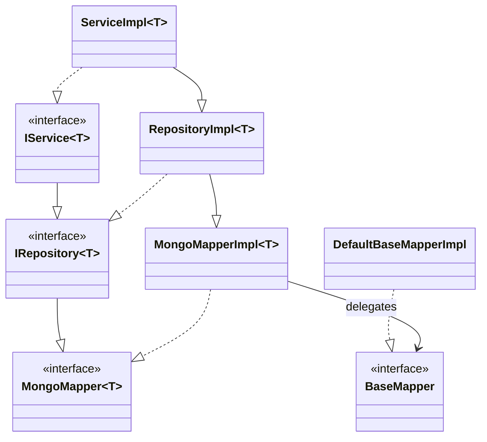

# 公开 API 选择指南

本文用于先选入口，再按需进入实现专题。结论来自当前源码；没有运行组合测试的能力只标为“静态可达”或“待验证”。

## API 分层

| 入口 | 获得方式与泛型 | 适合场景 | 真实执行关系 |
|---|---|---|---|
| 用户 `MongoMapper<T>` | 定义直接扩展 `MongoMapper<T>` 的接口，由 Boot/Solon 各自的容器接线创建代理；`T` 必须可直接解析 | 标准实体 CRUD，首选 | `MongoMapper` 不继承 `BaseMapper`；代理 target 是绑定实体类的 `MongoMapperImpl<T>`，后者组合并委托 `BaseMapper` |
| `BaseMapper` | 容器 Bean；core 也可由 `Configuration#getBaseMapper` 创建；自身不绑定实体 | 无实体、原始 BSON、框架级调用、手工索引 | `DefaultBaseMapperImpl` 解析实体 namespace，`AbstractBaseMapper` 汇入执行器 |
| `IRepository<T>` | 用户实现通常继承 `RepositoryImpl<T>` 并注册 Bean；框架不按实体自动生成 Repository Bean | 实体 CRUD、实体索引和 chain 便捷入口 | `IRepository<T> extends MongoMapper<T>`；另声明实体索引、`getCollection(database)` 和 query/update/aggregate chain；`RepositoryImpl` 继承 `MongoMapperImpl` |
| `IService<T>` | 用户 Service 继承 `ServiceImpl<T>` 并注册 Bean；不是扫描 Mapper 的替代品 | 业务服务层 | `IService<T> extends IRepository<T>`；`ServiceImpl<T> extends RepositoryImpl<T>` 且无新增方法、事务或返回值语义 |
| Chain API | Repository 方法或 `ChainWrappers` 工厂 | 增量构造条件并终结执行 | 持有 `BaseMapper` 和实体类，终结方法回调 Mapper |
| `MongoPlusClient` | 框架初始化并注入/由 core 配置取得 | 底层 database、collection、datasource 管理 | 基础设施入口；直接 Driver 操作不会自动获得 Mapper 转换便利 |

不存在名为 `Repository` 的公开契约；真实接口是 `IRepository<T>`，公开默认实现是 `RepositoryImpl<T>`。`BaseMapper` 也不是“无实体版 `MongoMapper`”：它是非泛型底层接口，继承 `Mapper -> SuperMapper -> BaseIndex`，每个实体/结果方法自己声明泛型；实体 Mapper、Repository 和 Service 最终都组合同一类 `BaseMapper`。默认实现类不应替代接口成为业务依赖。详见 [CRUD_EXECUTION.md](architecture/CRUD_EXECUTION.md) 和 [STARTUP_LIFECYCLE.md](architecture/STARTUP_LIFECYCLE.md)。

## BaseMapper 能力边界

### Insert

- 实体 `save`/`saveOne`、`saveBatch` 先经 `MongoConverter` 逐实体转 `Document`，ID、insert fill、字段 Handler、加密和敏感词处理取决于实体元数据及已注册扩展。
- `saveBatch` 空集合不是安全 no-op：`DefaultBaseMapperImpl` 直接读取 `iterator().next()`。
- `bulkWrite(List<WriteModel<Document>>, Class<?>)` 是 Driver model 入口，不做实体批量转换。普通拦截器是否生效取决于是否真正回写/重建 model，见 [CRUD_EXECUTION.md](architecture/CRUD_EXECUTION.md)。
- replace/upsert 受 Driver options 影响；布尔值通常是框架对结果的判断，不等同于内容一定改变。

### Query 与结果映射

- `list` 无结果返回空列表；`one` 无结果返回 `null`。单条入口不提供“多结果即异常”的唯一性契约。
- 实体类决定 namespace，返回类可另指定 DTO；DTO 不要求 `@CollectionName`，也不因作为结果类型自动登记 namespace。
- 普通 DTO/实体/`Document` 使用 `Class<R>`；嵌套泛型使用 `TypeReference<R>`。`Class<Map>` 与 `TypeReference<Map<...>>` 由 `MappingMongoConverter` 的 Map 转换逻辑处理；聚合入口说明见 [AGGREGATION.md](architecture/AGGREGATION.md)。
- projection、sort、skip、limit 在 wrapper/iterable 阶段应用；Tenant、Logic Delete、Dynamic Collection 在执行阶段增强 namespace/filter，详见 [QUERY_WRAPPER.md](architecture/QUERY_WRAPPER.md)。

### Update

| 形式 | fill/转换 | 加密 | 乐观锁 |
|---|---|---|---|
| entity + wrapper / updateById | 实体转换，update fill 可参与 | 实体字段路径可参与 | 实体版本元数据路径可参与 |
| wrapper-only `UpdateChainWrapper` | 直接构建 BSON，不走 update fill | 不自动做实体字段加密 | 仅拦截器可识别的路径 |
| 原始 BSON | 调用方负责 | 不自动转换 | 不保证 |

`matchedCount` 是命中条件数，`modifiedCount` 是实际改动数；相同值更新可命中但不改动。布尔包装不能表达二者全部差异。详见 [OPTIMISTIC_LOCK.md](features/OPTIMISTIC_LOCK.md)。

### Delete

- 配置实体逻辑删除后，常规 remove 可由高级逻辑删除拦截器转成 update；物理删除必须使用明确绕过逻辑删除的入口/上下文。
- `@IgnoreLogic` 覆盖范围不能按方法名推断；当前 executeUpdate 路径存在已确认缺口，见 [LOGIC_DELETE.md](features/LOGIC_DELETE.md)。
- Tenant 条件可追加到删除 filter；逻辑删除改写后的乐观锁参与范围取决于实体条件和 interceptor 顺序，不能概括为所有删除都有版本校验。

### Aggregate 与 Index

- 聚合入口是 `Aggregate`/`LambdaAggregateWrapper` 加 `aggregateList/aggregateOne`，或 `LambdaAggregateChainWrapper`；可指定 DTO、`Document`、`Class<R>` 或 `TypeReference<R>`。
- Tenant/Logic 只向顶层 pipeline 注入 match，不递归增强 lookup 子 pipeline；事务中由 `ExecutorFactory` 选择 `SessionExecute`。详见 [AGGREGATION.md](architecture/AGGREGATION.md)。
- 手工索引 API 在 `BaseMapper` 侧来自 `Mapper -> SuperMapper -> BaseIndex`，可按实体或显式 namespace 操作；普通 `MongoMapper<T>` 本身不声明索引方法，`IRepository<T>` 另行声明实体绑定索引便利方法并由 `RepositoryImpl` 委托 `BaseMapper`。动态集合 handler 不自动作用于索引；索引普通 before 无参数策略、after 仍运行。自动索引属于启动期，详见 [INDEX_AND_TIMESERIES.md](features/INDEX_AND_TIMESERIES.md)。

## Chain 与 Wrapper 家族

真实类型包括 `QueryWrapper`、`UpdateWrapper`、`LambdaQueryChainWrapper`、`LambdaUpdateChainWrapper`、`AggregateWrapper`/`LambdaAggregateWrapper`、`LambdaAggregateChainWrapper`。不存在独立的 `LambdaQueryWrapper` 或 `LambdaUpdateWrapper`；Lambda 字段重载来自共享条件接口。`QueryChainWrapper` 是抽象公共基类，不是独立终结入口；`UpdateChainWrapper` 可直接构造但只有绑定 `BaseMapper` 的 `LambdaUpdateChainWrapper` 才提供终结执行。

- Mapper 查询、分页、计数、存在性判断、实体更新，以及聚合 `match`、嵌套逻辑条件等接收查询条件的入口统一使用 `Wrapper<?>`；`QueryWrapper`、Query Chain 和 Update Wrapper 均可作为实参。函数式条件入口统一声明为 `SFunction<Wrapper<T>, Wrapper<T>>`。
- Repository 提供绑定自身实体和 Mapper 的 chain；`ChainWrappers.lambda*Chain(baseMapper, clazz)` 显式创建绑定 chain。无 Mapper 参数的工厂只构造条件。
- query/update chain 保存可变状态，条件原地累积；终结操作不会自动调用 `clear()`。显式 `clear()` 会清 query filter、sort、projection 和 custom BSON；`UpdateChainWrapper.clear()` 还清 update 元对象和 custom update BSON。聚合 wrapper 没有 clear/reset，pipeline、aggregate options 与 `isSkip` 都会保留。
- `CopyOnWriteArrayList` 只覆盖部分列表；sort/projection/custom query BSON 仍是普通 `ArrayList`，add/build/terminal 也没有统一同步或线程隔离。因此所有 Wrapper/Chain 都应按非线程安全、单次请求局部对象使用；持有的 `BaseMapper` 可是容器单例，不使 Wrapper 本身线程安全。
- Lambda 字段能读取映射名、ID/ObjectId、查询加密等实体元数据；字符串字段缺少 Java 字段引用检查和同等元数据保障。
- `condition=false` 的重载短路该条件；null/空集合没有全局统一的自动忽略规则。完整语义见 [QUERY_WRAPPER.md](architecture/QUERY_WRAPPER.md)。

## 无实体 Map/Document 模式

无实体占位类型是 `UnClassCollection`。`BaseMapper` 显式 database/collection 重载可操作 `Document`/BSON；Map 目标经 converter 的 Map 转换逻辑读取。

| 能力 | 边界 |
|---|---|
| CRUD / query / update | `Document`/原始 BSON 和显式 database/collection 可用；wrapper-only update 不做实体 fill/字段加密。`Map` 作为写入值与 `Map` 作为读取目标不是同一条转换路径 |
| namespace/registry | 无实体 `CollectionManager#getCollection` 以 `UnClassCollection.class` 登记显式 namespace；`putIfAbsent` 使其与以后实体首次登记存在顺序风险 |
| 结果 DTO / `Document` / `Map` | DTO 的 `Class<R>`/`TypeReference<R>` 不要求 `@CollectionName`，也不登记为 namespace 实体；`Document` 走原生结果；顶层 Map 由 converter 的 Map 转换逻辑读取，Map 写入与 BSON API 仍是独立路径 |
| Tenant / Sensitive Word GLOBAL | 两者在最终执行/BSON 层静态可达，不要求实体 registry；与无实体、批量 model 的组合仍需运行测试 |
| Logic Delete / Optimistic Lock | 依赖 namespace 对应实体类及其逻辑/版本元数据；登记为 `UnClassCollection` 时不能承诺这些实体能力 |
| Auto Fill / 字段 Handler | 原始 `Document`/BSON 不做实体转换，因而绕过实体 fill、字段注解写处理；指定 DTO 读取仍按读取转换链分别判断 |
| Encryption/Desensitization | 原始写 BSON 不自动实体加密；读 DTO/实体时才可能进入解密、ReadHandler/脱敏等读取处理 |
| Dynamic Collection | handler 可替换集合名；registry 风险见 [DYNAMIC_COLLECTION.md](features/DYNAMIC_COLLECTION.md) |
| Aggregate / Index / Transaction | 均有显式 namespace/执行入口；聚合 Map 目标经同一 converter 路径读取；动态集合不自动扩展索引，session 取决于当前事务上下文 |
| Multi Datasource / Recorder / Async / Backup | 数据源选择不以实体为前提；Recorder、异步多写和备份恢复均有底层入口，但无实体组合、镜像一致性和恢复语义不是已运行验证的稳定保证 |

以上“静态可达”不能写成未经运行测试的稳定组合保证。

## 多数据源、动态集合与事务

- `@MongoDs` 是用户入口，方法级优先于类级；`DataSourceHandler` 解析动态值。`DataSourceNameCache` 是编程式上下文但采用非栈式 ThreadLocal，嵌套、线程池传播和事务中换源有风险。默认名为 `master`。见 [MULTI_DATASOURCE.md](features/MULTI_DATASOURCE.md)。
- 动态集合使用 `CollectionNameHandler` 或显式 collection 名；handler 与 registry 是不同机制。见 [DYNAMIC_COLLECTION.md](features/DYNAMIC_COLLECTION.md)。
- 事务入口包括 `@MongoTransactional`、Boot 条件创建的 Spring manager 和 core 编程式 `MongoTransactionalManager`。`SessionExecute` 按当前 session 自动选择；直接 Driver 调用不会自动加入 Mapper 上下文。分片事务不保证分布式原子性。见 [TRANSACTION.md](features/TRANSACTION.md)。

## 扩展点速查

| 扩展 | 阶段与注册 |
|---|---|
| `Interceptor` / `AdvancedInterceptor` | Driver 执行周围；容器 Bean 或编程式注册，按 `order()` 排序 |
| `FieldHandler` / `TypeHandler` / `MappingStrategy` / `ConversionStrategy` / `ReadHandler` | 实体写入或读取。FieldHandler 默认 `order=0`，通过 `FieldHandlerChain.getInstance().register/registerAll` 注册，责任链在注册后稳定排序，转换时直接遍历；`HandlerCache.fieldHandlers` 仅为过渡兼容别名。双参数方法接收前序最新值，旧单参数实现继续兼容。ReadHandler 按既有 order 处理读取值。策略按泛型目标缓存，同 key 后写可覆盖 |
| `MetaObjectHandler` | 实体转换时 insert/update fill；wrapper-only BSON 不触发 |
| Tenant/Collection/DataSource Handler | 普通拦截或 AOP 上下文阶段 |
| Listener / Recorder / Async handler | Driver 命令、审计或镜像写；重复注册和异步生命周期分别见专题 |

这些缓存多为 JVM 静态状态；线程安全由实现负责，注册顺序见 [STARTUP_LIFECYCLE.md](architecture/STARTUP_LIFECYCLE.md)。

## 入口决策

| 任务 | 首选入口 |
|---|---|
| 标准实体 CRUD | 扫描的 `MongoMapper<T>` |
| 业务 Service | `IService<T>` + `ServiceImpl<T>` |
| CRUD 加 chain | `IRepository<T>` + `RepositoryImpl<T>` |
| DTO/条件查询 | Mapper/Repository Lambda query chain |
| 聚合 | Aggregate wrapper；需要绑定终结执行时用 aggregate chain |
| 原始 Document/无实体 | `BaseMapper` 显式 namespace 重载 |
| 手工索引 | 显式 namespace 用 `BaseMapper`；实体绑定便利方法用 `IRepository<T>`，不是普通 `MongoMapper<T>` |
| 多数据源/动态集合 | 常规 Mapper + `@MongoDs`/handler |
| 事务 | Mapper API + 已建立的事务上下文 |
| 完整 Driver 控制 | `MongoPlusClient`/Driver，自行承担转换与拦截差异 |

## 高风险入口

wrapper-only update 绕过 fill/encryption、ClientSession 生命周期、动态 registry 首次登记、异步多写非原子性、备份恢复非一致性、IgnoreLogic update 缺口和乐观锁 BSON 改写边界统一跟踪于 [OPEN_QUESTIONS.md](OPEN_QUESTIONS.md)。
