# CRUD 执行链路

> 审计日期：2026-08-01。结论来自当前源码。核心实现均在 Maven 模块 `mongo-plus-core`；扩展顺序详见 [EXTENSION_PIPELINE.md](EXTENSION_PIPELINE.md)。

## 公开入口与实现关系

| 入口 | 已确认关系 | 关键源码 |
|---|---|---|
| `BaseMapper` | 无实体绑定的 CRUD、聚合、索引公共 API；重载最终汇入显式命名空间和 BSON/Wrapper 实现 | `mapper/BaseMapper.java` |
| 用户 Mapper / `MongoMapper<T>` | `MapperProxy` 创建 JDK 代理；普通方法反射调用绑定实体类型的 `MongoMapperImpl<T>`，default 方法用 `MethodHandle` 在代理上执行 | `mapper/MongoMapper.java`、`mapper/MongoMapperImpl.java`、`proxy/MapperProxy.java` |
| `DefaultBaseMapperImpl` / `AbstractBaseMapper` | 前者解析实体命名空间并委托；后者构造 BSON、转换数据、调用执行器、读取结果 | `mapper/DefaultBaseMapperImpl.java`、`mapper/AbstractBaseMapper.java` |
| `IRepository<T>` / `IService<T>` | `RepositoryImpl` 继承 `MongoMapperImpl`；`ServiceImpl` 仅继承 `RepositoryImpl`，最终都委托 `baseMapper`。不存在名为 `Repository` 的公开契约 | `repository/IRepository.java`、`repository/impl/RepositoryImpl.java`、`service/IService.java`、`service/impl/ServiceImpl.java` |
| `ChainWrappers` 与 Query/Update/Aggregate chain | 链对象持有 `BaseMapper` 和实体类型；终结方法调用 Mapper。Repository 的链式入口由 `ChainWrappers` 创建 | `toolkit/ChainWrappers.java`、`conditions/query/QueryChainWrapper.java`、`conditions/update/UpdateChainWrapper.java`、`aggregate/AggregateChainWrapper.java` |

## 已确认的常规 CRUD 主链

```mermaid
flowchart LR
 A["BaseMapper / MongoMapper / IService / IRepository / Chain API"] --> B["MongoMapperImpl / DefaultBaseMapperImpl"]
 B --> C["AbstractBaseMapper"]
 C --> D["解析命名空间；构造 BSON / 写 Document"]
 D --> E["MongoPlusClient.getCollection"]
 C --> F["ExecutorFactory.getExecute"]
 E --> G["调用 Execute 方法：collection 为末项参数"]
 F --> G
 G --> H["外层 ExecutorProxy：普通 Interceptor"]
 H --> I["内层 AdvancedProxy：AdvancedInterceptor"]
 I --> J["DefaultExecute 或 SessionExecute"]
 J --> K["MongoCollection<Document> / MongoDB Driver"]
 K --> L["查询/聚合结果返回 Mapper"]
 L --> M["MongoConverter 转为目标类型"]
```

逐段证据：实体重载在 `DefaultBaseMapperImpl.getNamespace` 解析数据库/集合；`AbstractBaseMapper` 在执行前构造 BSON、写 `Document`；`MongoPlusClient`/`conn/CollectionManager.java` 取得并缓存集合；`ExecutorFactory` 根据事务上下文选择 `SessionExecute` 或 `DefaultExecute`，先包装高级链、再包装外层普通代理；执行实现直接调用 Driver；查询/聚合返回后，Mapper 才调用 converter 读成目标类型。集合注解解析位于 `handlers/collection/AnnotationOperate.java`。图中的 `getCollection` 与 `getExecute` 是同一 Mapper 方法内为一次 Execute 调用准备 collection 和执行器的两条支路，不把二者描述成彼此调用。

索引不经过 `AbstractBaseMapper` 的 CRUD 方法：`AbstractBaseMapper` 通过继承 `DefaultBaseIndexImpl`/`AbstractBaseIndex` 获得索引 API，索引方法直接取得 collection 和 Execute。它们仍经过两层执行代理，但当前 `ExecuteMethodEnum` 没有索引枚举，普通代理找不到参数策略，所以不调用普通 `beforeExecute`，只在目标正常返回后调用普通 `afterExecute`；高级链仍可拦截索引 Execute 方法。

## 操作如何汇合

| 操作 | 汇合路径 |
|---|---|
| insert/save | `writeBySave/writeBySaveBatch` → `executeSaveOne/executeSave` → `insertOne/insertMany`；之后回填 id。已废弃的单实体 `InsertManyOptions` 重载走单元素 `insertMany`。 |
| update | 实体 + Query chain 经 `ConditionUtil.getUpdateCondition`；Update chain 经 `buildUpdateCondition` 后由 converter 写更新 BSON；汇入 `executeUpdateOne/updateOne` 或 `executeUpdate/updateMany`。列表 pair 由实现逐项执行。 |
| remove/delete | Wrapper 经 `BuildCondition.queryCondition` 形成 filter；物理删除汇入 `executeRemoveOne/deleteOne` 或 `executeRemove/deleteMany`。高级逻辑删除插件可改成 update。 |
| find/query | 空条件、Wrapper、id、列值和命令入口形成 query/projection/sort → `executeQuery/find`；Mapper 再追加 skip/limit 等 iterable 选项并转换结果。 |
| page | 复用 query；完整分页另调用 count 或 `recentPageCount`，不是独立 Driver 操作。 |
| count | 条件计数 → `executeCount/countDocuments`；`canEstimatedDocumentCount` 仅在逻辑删除关闭、传入的 chain wrapper 非 null 且为空，并且租户被忽略或未注册 `TenantInterceptor` 时走 `estimatedDocumentCount`。当前 `SessionExecute.estimatedDocumentCount` 实际调用 **`countDocuments(clientSession)`**，与 `DefaultExecute` 的 `collection.estimatedDocumentCount()` 不同。 |
| aggregate | Aggregate pipeline → `executeAggregate/aggregate` → converter；链式聚合仍委托 Mapper。 |
| bulkWrite | 调用方提供 `List<WriteModel<Document>>` → `executeBulkWrite/bulkWrite`；不做实体批量转换。普通拦截器只有显式原地修改 model 内容或返回重建列表才真正生效；当前 Tenant 的 UpdateMany 临时 pair 修改不会回写 model，Logic 的 UpdateMany 会重建列表。 |
| 索引 | `AbstractBaseIndex` → `Execute.doCreateIndex(es)/doListIndexes/doDropIndex(es)` → `MongoCollection` 索引 API；经过普通代理和高级代理，但当前索引方法没有普通参数策略，详见上文。源码：`index/impl/AbstractBaseIndex.java`。 |

## 处理阶段

| 能力 | 精确位置 |
|---|---|
| 数据库/集合名 | 实体模式在 `DefaultBaseMapperImpl` 执行前解析；显式模式由调用方给出；动态集合在普通 `beforeExecute` 替换最后一个集合参数。 |
| 实体元数据 | converter 的 `TypeInformation/FieldInformation`；集合命名空间到实体的登记在集合管理路径。 |
| Wrapper → BSON | 执行代理外，由 `BuildCondition`、`UpdateChainWrapper` 或 Aggregate 构建。 |
| 实体 → Document | 执行代理之前，由 `MongoConverter` 完成。 |
| Document → 实体 | Driver 与两类代理返回之后，由 Mapper 调用 `read/readDocument`。高级拦截器看到 Driver 原始结果而非最终实体列表。 |
| 自动填充 | converter 写保存/更新 Document 时调用 AutoFill/`MetaObjectHandler`，在两类执行代理之前。 |
| 逻辑删除 | 插入默认值与条件增强属于普通拦截；remove→update 属于高级 `LogicRemoveInterceptor`，不是单一阶段。 |
| 多租户 | 普通 `TenantInterceptor` 改 Document、filter、pipeline、count 和 bulk model。 |
| 动态集合 | 普通 `DynamicCollectionNameInterceptor.beforeExecute` 替换 `args` 最后一项。 |
| TypeHandler/转换器 | `TypeHandlerFieldHandler` 在写字段循环中运行；`MappingStrategy/ConversionStrategy` 分别参与写/读映射，均不是执行拦截器。 |
| 普通拦截器 | 最外层 `ExecutorProxy`：仅当方法能映射到 `ExecuteMethodEnum` 且存在参数策略时，才对每个插件依次执行 `beforeExecute` 并立即执行该插件的参数策略；随后调用高级链；目标正常返回后，无论是否存在参数策略，均按链顺序执行 `afterExecute`。 |
| 高级拦截器 | 普通代理内层，包围 `DefaultExecute/SessionExecute`，可 proceed、短路、改返回或异常。 |

## 实体、Map 与批量模式

实体模式可解析命名空间并使用字段注解、自动填充和类型处理。Map/Document 模式通常显式提供命名空间，Map 写入走 `MappingMongoConverter.write(Map,Bson)`，没有实体字段注解元数据；依赖集合到实体映射的逻辑能力在找不到实体类时跳过。`saveBatch` 先整体转 Document 后一次 `insertMany`；`bulkWrite` 直接接受 Driver model；多 pair update 不是 Driver bulkWrite。

## 扩展、异常和修改检查

扩展点包括 `MongoConverter`、`TypeHandler`、映射/转换策略、`MetaObjectHandler`、`CollectionNameHandler`、`TenantHandler`、普通/高级拦截器及 Driver `Listener`，分类见 [EXTENSION_PIPELINE.md](EXTENSION_PIPELINE.md)。

`MapperProxy` 和 `ExecutorProxy` 有显式反射异常解包。`AdvancedProxy` 只在高级拦截器未激活、直接反射调用 target 的分支解包；激活分支直接返回 `intercept(...)`，而 `Invocation.proceed()`/`discontinue()` 自身没有解包，因此不能声称高级链所有反射异常都统一解包。普通前置/参数改写抛错会阻止 I/O；目标或高级链抛错时不执行普通 after。Driver Listener 回调抛出的 `Exception` 被 `BaseListener` 包成 `MongoPlusInterceptorException` 后再次抛出。

修改主链至少检查：所有 BaseMapper 重载与实体命名空间委托；Service/Repository/chain 汇合；实体/Map/BSON、单条/批量、事务执行器；`ExecuteMethodEnum` 与 `ExecutorProxyCache`；最后一个参数为 collection 的约定；转换、填充、id 回填、逻辑删除、租户、动态集合顺序；page 双调用、aggregate、bulkWrite、索引；Boot 3/4 与 Solon Mapper 装配。

## 测试证据与缺口

仓库当前没有 `src/test` 文件；CodeGraph 对 `BaseMapper`、`MapperProxy`、`AbstractBaseMapper`、`ExecutorFactory`、`ExecutorProxy` 均报告无覆盖测试。缺口包括 CRUD 重载汇合、Mapper 两类方法代理、两类拦截链及异常、实体/Map 映射、逻辑删除+租户+动态集合组合、事务执行、page 双调用、bulkWrite 和索引。
