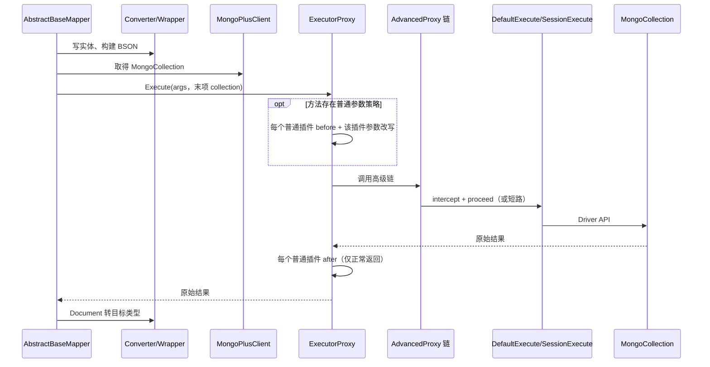

# 扩展机制与执行顺序

> 审计日期：2026-08-01。基于 `mongo-plus-core` 当前源码。CRUD 汇合点见 [CRUD_EXECUTION.md](CRUD_EXECUTION.md)。执行拦截、映射、元数据回调、条件增强、路由和 Driver 命令监听不是同一条“拦截器链”。

## 总体顺序

`execute/ExecutorFactory.java` 先 `AdvancedInterceptorChain.wrap`，再 `ExecutorProxy.wrap`，故普通代理在外。实体写入、Wrapper 构建和 collection 获取均发生在调用 Execute 方法前；查询结果转换在返回后。图描述的是 `AbstractBaseMapper` 的常规 CRUD；索引从 `AbstractBaseIndex` 发起，且没有普通参数策略。

## 普通拦截机制

关键源码：`interceptor/Interceptor.java`、`interceptor/InterceptorChain.java`、`proxy/ExecutorProxy.java`、`cache/global/ExecutorProxyCache.java`、`strategy/executor/`（模块：`mongo-plus-core`）。

- 注册：`Configuration.interceptor(...)` 等单个入口调用 `addInterceptor` 并按 `order()` 升序排序。`addInterceptors(List)` 自身不排序；Boot 3/4 批量加入用户 Bean 后调用链排序，Solon 先对本批 Bean 排序再追加。随后 Tenant/Dynamic 的单个注册会对整个静态链重排。直接使用 core 批量 API 而不再排序仍保留追加顺序。
- 操作：save one/many、remove one/many、update one/many、query、aggregate、count、estimated count、bulkWrite 有枚举/参数策略。当前索引方法不在 `ExecuteMethodEnum` 中，因此不执行普通 before/参数策略；正常返回后普通 after 仍会遍历。
- 时机：存在参数策略时，代理先保存最后一个参数所指的原集合；对每个插件依次调用 `beforeExecute`，随即调用该操作策略并把返回值写回 args，然后才处理下一个插件。不存在策略时跳过全部普通 before。之后进入高级链；正常返回后始终按链顺序调用 `afterExecute`。
- 能力：可改 Document、filter、query/projection/sort、pipeline、count options、bulk model；`before` 可直接改 args，动态集合即替换最后一项。after 接口返回 void，不能被框架接收为替代结果，但可原地改可变对象。
- 异常：普通前置、参数方法、after 异常直接传播；`ExecutorProxy` 解包其目标反射异常。目标/高级链失败时不执行普通 after，没有统一 error 回调。

重要细节：动态集合替换 args 后，实际执行使用新集合，但 `ExecutorProxy` 传给同次专用拦截方法及 after 的局部 `collection` 仍是进入代理时的原集合。插件组合不可假定都观察到新集合。

## 高级执行代理机制

关键源码：`interceptor/AdvancedInterceptor.java`、`AdvancedInterceptorChain.java`、`Invocation.java`、`proxy/AdvancedProxy.java`、`execute/Execute.java`、`execute/instance/DefaultExecute.java`、`SessionExecute.java`。

- 链按 `order()` 降序保存，再按列表顺序逐层包装；后包装者在外。因此运行时较小 order 先进入。相同 order 不应作为业务顺序契约。
- `AdvancedProxy` 检查 `activate()` 后调用 `intercept(Invocation)`。实现可围绕 `proceed()` 做前置、后置、异常逻辑，改 args/原始返回值，或不 proceed 而短路。未激活分支由 `AdvancedProxy` 解包 target 的反射异常；激活分支中的 `Invocation.proceed()` 不负责解包。
- `discontinue()` 用新建 `ExecutorFactory` 的 `getOriginalExecute()` 直接执行当前方法，不进入当前 target 内侧尚未执行的高级代理，也不重新进入外层普通代理；已经进入的外层高级拦截器仍会按其自身代码继续返回路径。
- 高级接口没有统一 before/after/error 方法；异常是否吞掉由实现决定。最内层 `DefaultExecute/SessionExecute` 才调用 `MongoCollection`，故高级插件包围实际 I/O。

## 其他扩展机制

| 机制 | 分类 | 可改变内容 | 关键源码 |
|---|---|---|---|
| `FieldHandler` / `TypeHandler` | 映射扩展，不是执行拦截器 | 写侧由 `FieldHandlerChain` 自持全局责任链并负责注册、稳定排序；字段映射直接依赖并遍历责任链，向双参数 handler 传递最新值。`HandlerCache.fieldHandlers` 仅为过渡兼容别名。旧单参数实现由默认方法兼容。`TypeHandler.setParameter` 改写入值，`TypeHandler.getResult` 参与实体字段读取 | `handlers/FieldHandler.java`、`handlers/FieldHandlerChain.java`、`handlers/TypeHandler.java`、`handlers/field/TypeHandlerFieldHandler.java`、`mapping/AbstractMongoConverter.java`、`MappingMongoConverter.java` |
| `MappingStrategy` / `ConversionStrategy` | 映射扩展 | 写方向复杂值映射、读方向目标值转换 | `strategy/mapping/MappingStrategy.java`、`strategy/conversion/ConversionStrategy.java` |
| `MetaObjectHandler` / AutoFillHandler | 元数据扩展、写入生命周期回调，不是执行拦截器 | 插入/更新 Document 的填充字段；位于两类执行代理外 | `handlers/MetaObjectHandler.java`、`handlers/auto/AbstractAutoFillHandler.java`、`mapping/AbstractMongoConverter.java` |
| `TenantHandler` | 策略 Handler，不是拦截器 | 提供租户值、列名、忽略规则；普通 `TenantInterceptor` 才实际改参数 | `handlers/TenantHandler.java`、`interceptor/business/TenantInterceptor.java` |
| `CollectionNameHandler` | 路由 Handler，不是拦截器 | 被普通 `DynamicCollectionNameInterceptor` 调用以计算新集合名；不选择数据源 | `handlers/CollectionNameHandler.java`、`interceptor/business/DynamicCollectionNameInterceptor.java` |
| `Listener` | Driver `CommandListener` 后的独立监听机制，不是两类执行拦截器 | 接收 command started/succeeded/failed，不在 Mapper 返回转换链内；实现也可校验并抛错 | `listener/Listener.java`、`BaseListener.java`、`MongoPlusListener.java`、`cache/global/ListenerCache.java` |
| 逻辑删除 Handler/Manager | 元数据、条件增强 | 实体逻辑字段、BSON/Wrapper 增强；执行分别依赖普通与高级插件 | `logic/LogicDeleteHandler.java`、`interceptor/business/CollectionLogiceInterceptor.java`、`LogicAutoFillInterceptor.java`、`LogicRemoveInterceptor.java` |
| sharding Handler/Interceptor | 数据源路由、执行扩展 | 可改变数据源/分片行为，不等同动态集合 | `mongo-plus-sharding/src/main/java/com/mongoplus/interceptor/DataSourceShardingInterceptor.java` 等；完整组合链未在本文展开 |

## 已确认的交互

- 通过 `ExecutorFactory.getExecute()` 的一次受支持 CRUD 同时经过普通外层与高级内层；高级短路若正常返回，普通 after 仍运行。
- 用户 Wrapper 先在 Mapper 层变为 BSON；普通逻辑删除/租户可再次增强。逻辑 remove→update 在高级阶段。
- 实体→Document 在代理前，Document→实体在代理后；高级插件处理的是执行参数和 Driver 原始结果。
- 当前内置普通 order 为 Tenant 0、Dynamic Collection 2、Collection Logic/Logic Auto Fill 默认最大值；可选 GLOBAL sensitive-word 也使用默认最大值。因此确定前缀是 Tenant → Dynamic，Logic/GLOBAL 等同 order 项的相对次序取决于注册先后。Java 当前稳定排序会保留同 order 的现有相对顺序，但容器 Bean 枚举、静态跨上下文累积和未排序 core 批量调用都不是公开契约；同 order 不应承载业务依赖。
- `ExecutorProxy` 在进入循环前捕获原 collection。Dynamic 会替换 `args` 最后一项，后续高级代理和 Driver 看到新 collection；后续普通专用策略仍收到捕获的原 collection。Logic delete 因而可能在普通阶段按原 namespace 加过滤、高级 remove 阶段按动态 namespace 决定是否转 update。
- Listener 由 MongoDB Driver `CommandListener` 在 started/succeeded/failed 命令阶段触发；回调抛出的 `Exception` 由 `BaseListener` 包成 `MongoPlusInterceptorException` 并再次抛出。它不是 `InterceptorChain` 或 `AdvancedInterceptorChain` 的一环。
- 普通插件可改参数/集合；高级插件可改参数、短路、改原始结果/异常；映射扩展改转换；`CollectionNameHandler` 计算集合名；`TenantHandler` 提供策略；Listener 接收命令事件，其中 `BlockAttackInnerListener` 还会执行阻断校验。

## 待验证顺序

- `Configuration`、Boot 3、Boot 4、Solon 各自注册来源及重复初始化下的最终全局列表内容；已确认普通 `addInterceptors(List)` 自身不排序，Boot 3/4 会在追加后排全链，Solon 只先排本批但后续内置单个注册会重排全链；高级 `addInterceptors(List)` 会排序，容器初始化后会调用 `ListenerCache.sorted()`。不把这些规则概括为完全相同。
- 内置普通插件相同 order 的顺序，以及动态集合后其他插件看到原集合这一实现是否符合设计意图。
- `mongo-plus-sharding` 数据源选择相对动态集合、事务 `SessionExecute`、高级异步多写的完整组合顺序。
- 高级异步执行与 Driver command succeeded/failed、调用方返回之间的时序保证。

## 风险

- 兼容性：新增 Execute 方法必须同步 `ExecuteMethodEnum`、策略缓存和末位 collection 约定。
- 顺序：order 或注册排序改变会影响租户、逻辑删除、动态集合；高级链是“排序后逐层包装”。
- 重入：高级插件通过 Mapper/`getExecute()` 再发同类操作会重入；`proceed` 与 `discontinue` 不可混用。
- 异常吞掉：高级插件可捕获并替代结果；普通链无 error，失败不运行 after；`BaseListener` 会重新抛出包装异常，但 MongoDB Driver 对各命令监听回调异常的最终处理语义未在本仓源码中定义，本文不进一步推断。
- 同步/异步：异步多写可能改变返回、事务上下文、Listener 时序。
- 多数据源/事务/分片：工厂按事务上下文选择 session 执行器；动态集合仅改集合；分片可改数据源，组合必须验证会话与路由一致。
- 全局状态：两类链及多个 Handler/Listener cache 是静态可变状态，重复初始化、并发注册和测试隔离有污染风险。

## 测试证据与缺口

仓库已在 `mongo-plus-sensitive-word` 增加 FieldHandler 转换器级测试；reactor 外 `mongo-plus-test` 以 2 项回归覆盖 Logic Ignore update 早期短路，并以 2 项回归覆盖 Tenant bulk `UpdateManyModel` 的 BSON/pipeline 重建与 filter 写回。ExecutorProxy 全链、MetaObjectHandler 等仍无完整覆盖。缺口：普通 before→参数策略→after 与异常；高级 order/嵌套、短路/discontinue；两链组合；动态集合+租户+逻辑删除；其他 bulk model；Listener 三阶段/异常；事务、异步、分片、多数据源组合。
