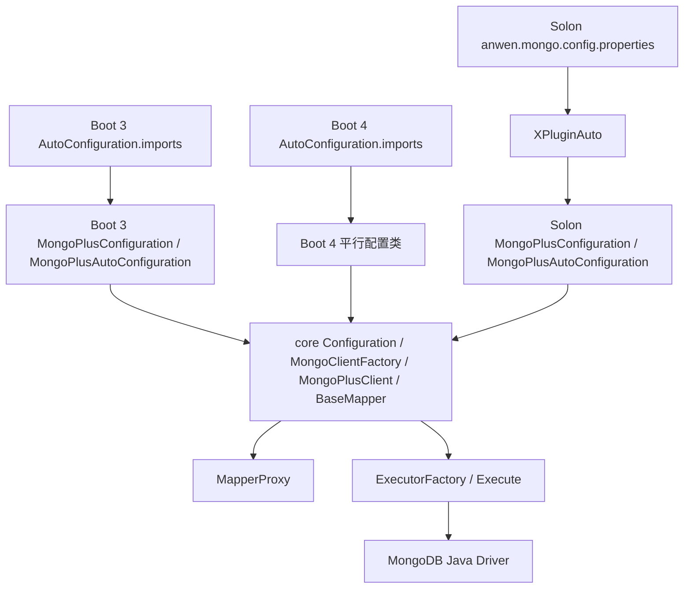
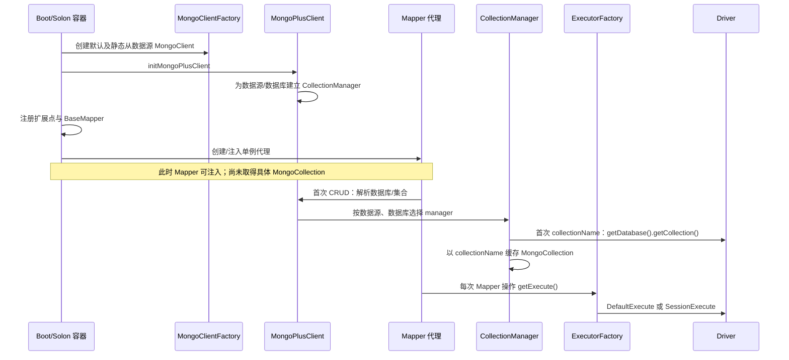

# 启动生命周期

> 审计日期：2026-08-02。本文描述 Boot 3、Boot 4 与 Solon 从容器启动到 Mapper 可执行首个请求的当前源码行为。CRUD 内部阶段见 [CRUD_EXECUTION.md](CRUD_EXECUTION.md)，扩展点执行阶段见 [EXTENSION_PIPELINE.md](EXTENSION_PIPELINE.md)，多数据源选择见 [MULTI_DATASOURCE.md](../features/MULTI_DATASOURCE.md)。

## 集成入口与共享边界

### Spring Boot 3 与 Boot 4

两个 starter 的 `META-INF/spring/org.springframework.boot.autoconfigure.AutoConfiguration.imports` 都按相同顺序列出 9 个配置类：`MongoPlusConfiguration`、`MongoPlusAutoConfiguration`、`OverrideMongoConfiguration`、可选敏感词配置、Spring 属性、字段属性、事务管理器、属性配置和逻辑删除属性。两套 Java 源码平行维护，不是同一源码的 profile；当前核心 Bean、扩展发现、Mapper scanner/factory 和 `@MongoDs` 切面行为相同。

`MongoPlusConfiguration` 通过 `@EnableConfigurationProperties` 绑定连接、集合、全局配置和日志属性。Bean 方法以 `@ConditionalOnMissingBean` 允许用户替换 `MongoClientFactory`、默认 `MongoClient`、`MongoPlusClient`、`MongoConverter`、`BaseMapper`、切面和 `DataSourceManager`。存在多个 `MongoClient` 时，MongoPlus 主链不是按 `@Primary` 搜索任意客户端：默认 Bean 来自 `MongoClientFactory.getMongoClient()`，命名数据源也从该工厂按名称取得；用户替换 Bean 后的组合需要启动测试确认。

`@MongoMapperScan` 导入 `MongoMapperScannerRegistrar`。扫描器只接受实现 `MongoMapper` 的接口，并把 BeanDefinition 的 bean class 改为 `MongoMapperFactoryBean`。FactoryBean 从 BeanFactory 取得唯一 `BaseMapper`，再调用 `MapperProxy.wrap(baseMapper, mapperInterface)`。未使用 `@MongoMapperScan` 时，不存在 starter 的隐式全包扫描证据。

### Solon

`META-INF/solon/anwen.mongo.config.properties` 指向 `XPluginAuto`。插件创建 Solon 配置类和属性/拦截器 Bean，并为 `@Inject` + `MongoMapper` 注册注入器；符合 `MongoMapper` 且带 `@Mongo` 的接口由 `MapperProxy.wrap` 创建代理。Solon 属性由 `@Inject("${mongo-plus...}")` 注入，不使用 Spring 的 configuration-properties 机制。

Solon 复用 core 的 `Configuration`、`MongoClientFactory`、`MongoPlusClient`、`DefaultBaseMapperImpl`、转换器、执行器及代理，但容器发现代码独立。`MongoDataSourceAspect` 实现类的静态行为是：只读取方法注解，不读取类注解、不解析 SpEL、不调用 `DataSourceHandler`，并把被拦截方法异常包装为 `RuntimeException`。但是 `XPluginAuto` 只对 `@MongoTransactional` 显式调用 `beanInterceptorAdd`，对 `@MongoDs` 仅创建拦截器 Bean；当前仓库源码未显示注解到该拦截器的绑定，因此 Solon 路由是否实际生效、由何种容器约定触发均待集成测试，不能把上述实现类行为直接写成已生效能力。Boot 3/4 的 Spring 切面已显式匹配类级或方法级 `@MongoDs`。Boot 4 当前没有对应的 sharding starter，见 [COMPATIBILITY.md](../COMPATIBILITY.md)。

## 核心资源何时准备

| 对象/步骤 | 当前时机与行为 |
|---|---|
| 配置与 `MongoClient` | 容器创建 `MongoClientFactory` 时，默认和 `slaveDataSource` 配置均调用 `MongoUtil.getMongo`；Driver 客户端对象在启动期创建。Driver 通常延迟真正网络连接，因此源码不能保证连接错误必在启动时暴露。 |
| `MongoPlusClient` | 启动 Bean 创建期调用 core `Configuration.initMongoPlusClient`；登记默认数据源，starter/plugin 随后为工厂中的每个数据源建立数据库到 `CollectionManager` 的映射。 |
| `MongoDatabase` | core 初始化时通过 `MongoClient.getDatabase` 取得默认数据库句柄并保存；这是轻量句柄，不等于已发起服务器命令。 |
| `MongoCollection` / `ConnectMongoDB` | 首次请求某个集合时，`CollectionManager` 创建 `ConnectMongoDB` 并调用 `open()`；结果按集合名缓存。后续同 manager、同集合名直接命中缓存。 |
| `MongoEntityMappingRegistry` | 全局单例；仅在某集合首次创建时，以 Driver namespace full name 登记实体类。不是启动期全量扫描。 |
| `BaseMapper` / converter | 容器启动期创建；默认实现是 `DefaultBaseMapperImpl`。 |
| `ExecutorFactory` / `Execute` | Mapper 内持有工厂；每次操作调用 `getExecute()`，按当前事务上下文新建 `DefaultExecute` 或 `SessionExecute`，再套高级和普通代理。 |
| Mapper 代理 | Boot FactoryBean 的 `getObject()` 或 Solon 注入回调调用 `MapperProxy.wrap` 时创建。`MapperProxy` 构造器同步创建 `MongoMapperImpl` target，并立即从 mapper 接口的直接泛型接口解析实体类型；不是首次 CRUD 才解析。Spring FactoryBean 缓存字段只有在容器已存在该接口 Bean 时赋值；常规 FactoryBean 产品是否单例遵循 Spring `FactoryBean` 默认语义，源码未覆盖 `isSingleton()`，需容器测试固定。 |
| `IService` / `IRepository` | 框架提供 `ServiceImpl`/`RepositoryImpl` 类型，但没有启动期自动发现全部实现的 core 机制；由用户容器 Bean 创建，最终持有/委托 `BaseMapper`。 |

Map/Document 无实体模式从显式数据库、集合名的 `BaseMapper` 重载进入同一 collection/execute 路径。它**不会跳过 namespace 登记**：不带实体类的 `CollectionManager.getCollection(...)` 重载传入 `UnClassCollection.class`，首次创建集合时仍以 `database.collection` 为 key 调用 registry 的 `putIfAbsent`。依赖实体元数据的逻辑把 `UnClassCollection` 视为无实体标记并跳过；同一 namespace 后续再以实体类访问也不会覆盖首次登记，组合影响仍需测试。详见 [CRUD_EXECUTION.md](CRUD_EXECUTION.md)。

## 扩展注册顺序

Boot 3/4 的 `MongoPlusAutoConfiguration` 构造器调用 `init()`，固定调用顺序为：ConversionStrategy → MetaObjectHandler → Listener → 普通 Interceptor → MappingStrategy → IdentifierGenerator → TenantHandler → CollectionNameHandler → Aware → 集合名转换 → 自动时间序列 → 自动索引 → IdGenerateHandler → AdvancedInterceptor。之后 `afterPropertiesSet()` 为容器中的 `MongoMapper` 设置实体类型/BaseMapper，并配置逻辑删除字段。

Solon 的顺序为：ConversionStrategy → MetaObjectHandler → Listener → 普通 Interceptor → MappingStrategy → IdentifierGenerator → 集合名转换 → 自动时间序列 → 自动索引 → IdGenerateHandler → AdvancedInterceptor → CollectionNameHandler → TenantHandler。其 Mapper 回调由 `subBeansOfType` 驱动。注册先后不等于 CRUD 运行阶段；运行阶段以 [EXTENSION_PIPELINE.md](EXTENSION_PIPELINE.md) 为准。

| 扩展点 | 来源与容器 | 排序/覆盖/重复 |
|---|---|---|
| 普通 `Interceptor` | core `InterceptorChain` 静态列表；Boot/Solon 收集容器 Bean，租户和动态集合另行追加 | Boot 收集后调用 `sorted()`；Solon先按 order 排序再批量加入。静态列表不去重，重复初始化可累积。 |
| `AdvancedInterceptor` | `AdvancedInterceptorChain` 静态列表 | 批量加入会按实现规则排序；不去重。 |
| `Listener` | `ListenerCache.listeners`；日志/阻断内置项后追加用户 Bean | 最后 `ListenerCache.sorted()`；不去重。 |
| `MappingStrategy` / `ConversionStrategy` | 按泛型目标类型写入全局 cache | 同 key 后写覆盖；泛型解析失败抛 `MongoPlusConvertException`。 |
| `MetaObjectHandler` | `HandlerCache.metaObjectHandler` | 遍历 Bean 逐次赋值，最终值依赖容器迭代顺序；没有显式 order。 |
| `TenantHandler` / `CollectionNameHandler` | 取单 Bean，包装为普通拦截器 | 找不到则不注册；多个 Bean 的容器选择/异常被捕获的细节不应视作稳定覆盖规则。 |
| TypeHandler、加密、脱敏 | 由字段注解/字段 Handler 与可选模块参与映射；不是上述容器统一列表 | 具体优先级见映射与扩展专题；启动文档不重复推断。 |
| 逻辑删除 | 属性 Bean + `afterPropertiesSet`/Solon Mapper 回调配置实体逻辑字段，执行时由普通/高级插件实现 | 依赖 Mapper 实体发现时机；无实体模式没有实体逻辑元数据。 |

## Mapper 生命周期与失败边界

- 代理的普通接口方法最终反射调用绑定实体类型的 `MongoMapperImpl`。接口代理路径在 `MapperProxy.buildTarget()` 中调用 `getGenericClass(mapperInterface)`：只检查 mapper 接口的直接 `getGenericInterfaces()`，并把第一个实际类型参数直接强转为 `Class<?>`。直接参数化 `MongoMapper<Entity>` 会在代理创建时绑定；间接继承、类型变量或参数化类型可能得到 `null` 或在代理创建时抛类型转换异常。容器何时触发 FactoryBean `getObject()` 仍影响失败是在启动期还是首次取 Bean 暴露，需 Boot/Solon 集成测试固定。`MongoMapperImpl.getGenericityClass()` 是实现类/容器 Bean 的另一条泛型解析路径，不应与接口代理路径混写。
- namespace→实体映射不在 Mapper 注册时登记，而在 `CollectionManager` 首次创建 `MongoCollection` 时登记。
- 启动期可确定的配置失败包括 database 为空时 `InitMongoPlusException`；core builder 的 `getMongoPlusClient()` 还显式检查 URL。容器路径调用带现成 client 的 `initMongoPlusClient`，其直接检查是 database。
- `MongoClientFactory` 是进程级静态单例，命名注册使用 map `put`；重复名称会替换旧引用。替换时没有关闭旧 client 的代码。
- `MongoClientFactory` 实现 `AutoCloseable`，`close()` 遍历并关闭 map 中当前 clients。Spring 对 `@Bean` 的推断销毁方法应命中该 `close()`，但当前仓库没有关闭集成测试；Solon 源码未注册停止回调，是否由容器自动识别 `AutoCloseable` 尚缺运行证据。事务 `ClientSession` 由事务切面/管理器的提交、回滚与 `closeSession` 路径管理，不由工厂统一关闭。
- collection 首次创建失败时不会写缓存，下一次会再次创建；Driver 句柄创建通常本身不做网络 I/O，真实命令失败会在 Execute 阶段暴露。

## 修改启动流程检查清单

- 同步核对 Boot 3、Boot 4 两套 `AutoConfiguration.imports` 和平行 Java 源码。
- 核对 Solon `XPluginAuto`、配置注入、Bean 条件和 Mapper 注入差异。
- 保持 `MongoClientFactory` → `MongoPlusClient` → `BaseMapper` → Mapper 的依赖顺序。
- 检查用户覆盖 Bean、多个同类型 Bean、重复容器初始化及静态 cache 污染。
- 检查 Mapper 泛型、Map 模式、namespace 登记和逻辑删除初始化。
- 检查普通/高级拦截链、Listener、Handler 的注册顺序与实际运行顺序。
- 检查默认/从数据源、动态注册、事务 session 与资源关闭。
- 按 [TESTING.md](../TESTING.md) 分别运行 Boot 3、Boot 4、Solon 启动和首个 CRUD。

## 当前测试证据缺口

reactor 内没有可执行的启动回归测试。至少缺少：9 个自动配置入口加载、用户 Bean 覆盖/重复 Bean、Mapper scanner 与 FactoryBean 单例语义、无法解析泛型、缺失 URL/database、启动期与首次命令连接错误、首次 collection 失败重试、静态 cache 重启污染、Spring/Solon 关闭 client，以及三套集成的扩展顺序。完整策略见 [TESTING.md](../TESTING.md)，未确认问题见 [OPEN_QUESTIONS.md](../OPEN_QUESTIONS.md)。
